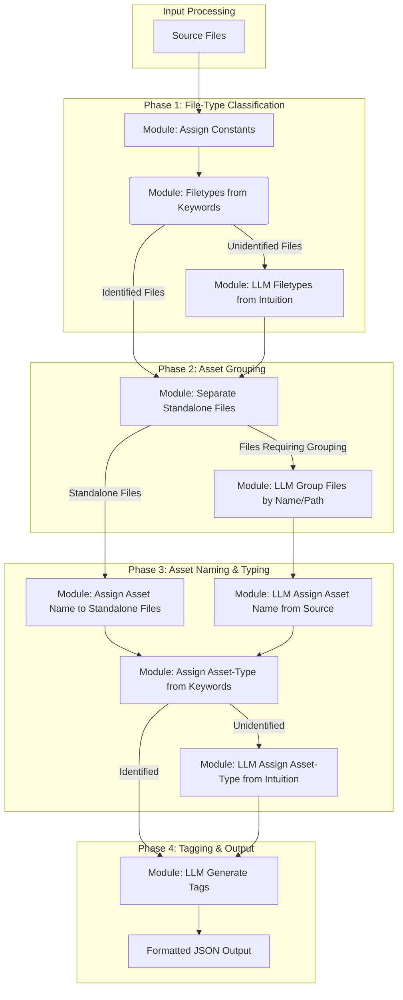

# Asset System - Classification Service

The core of the application's automated organization is the **Classification Service**. This service is designed to intelligently interpret the unstructured data from a source archive/directory and organize it into the structured JSON format.

The user invokes the service from the UI. The UI calls the `ClassificationService`, providing it with the **current state of the asset data structure** and a snapshot of the necessary classification rules from the central configuration. The service processes this data through a pipeline of classification modules. The results are returned to the UI for user review.

This service uses a hybrid approach:

-   **Rule-Based Classification:** Fast and predictable assignment based on predefined constants and filename keywords.
-   **LLM-Based Classification:** For ambiguous cases, a Large Language Model provides intuitive classification for file-types, asset groupings, asset names, and tags.

---

## Modular Pipeline Architecture

The Classification Service is architected as a **modular pipeline**, processing asset data through a series of specialized, independent modules. This design makes the classification process highly extensible and maintainable.

### Module I/O Contract & State

Every module in the pipeline adheres to a simple contract:

-   **Input:** The **current asset data structure**. This is critical because the service is designed to **enrich existing data, not discard it**. It receives the state directly from the UI, respecting any manual classifications or refinements the user has already made.
-   **Output:** The **modified asset data structure**, which is then passed to the next appropriate module in the pipeline.

For scenarios where a user wishes to start over, the service can be invoked in a **"re-classify" mode**. This option, accessible from the UI, would regenerate the asset structure from the raw source file list, ignoring any previous user modifications for that specific source.

### Conditional Routing (DAG)

The pipeline is not a simple linear sequence; it is a **Directed Acyclic Graph (DAG)**, as visualized in the flowchart. This allows for conditional routing of data.

Some modules have multiple potential outputs. For example, the "Filetypes from Keywords" module partitions its results:
-   **Identified Files:** Files that are successfully classified are routed directly to the next major phase (e.g., Asset Grouping).
-   **Unidentified Files:** Files that remain unclassified are routed to a more specialized module (e.g., "LLM Filetypes from Intuition") for further analysis.

This ensures that data only flows to the modules that are necessary, making the process efficient and logical.

### Progressive Enrichment

The asset data structure is progressively enriched as it passes through the pipeline.

1.  **Initial State:** The structure as received from the UI. It can range from a simple file list to a partially classified set of assets.
2.  **After File-Type Modules:** The `contents` objects are updated with a `filetype` for each file.
3.  **After Asset Grouping Modules:** The `Assets` dictionary is populated, and files are assigned to specific assets.
4.  **After Naming & Tagging Modules:** The assets are given names, types, and descriptive tags.
5.  **Final State:** The final, fully classified JSON object is returned.

---

### Classification Flow

The service processes inputs in a sequence designed to handle the most straightforward cases first. Each node in this flowchart represents a **Classification Module**, and the branching arrows illustrate the **conditional routing** of the asset data. For example, after the "Filetypes from Keywords" module, unidentified files are passed to the LLM module, while identified files proceed directly to the "Asset Grouping" phase.

Note: The "Separate Standalone Files" module uses the `is_standalone` property defined on `File-Type` entries in configuration to route files that should be treated as stand-alone assets.
