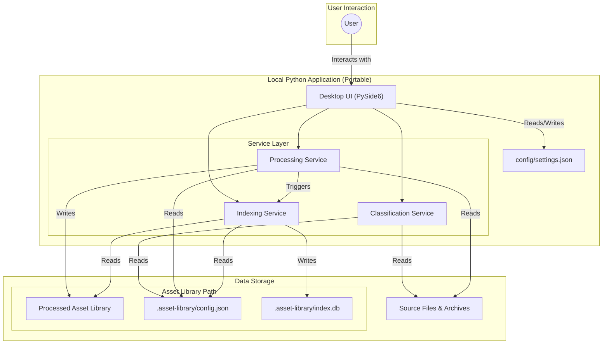

# Asset System - Overview

## Architecture

The Asset Organiser is a fully portable, local Python application built with PySide6. Its architecture is designed for modularity and clarity, with a strict separation between the user interface and the core logic.

The application is composed of several distinct services, each responsible for a specific part of the workflow. The main UI, built with PySide6, orchestrates the calls to these services. All application-specific configuration is stored within the application's own directory, ensuring it can be moved or copied without losing settings. Asset library configurations are stored within the root of each library, making the libraries themselves fully portable.

## Mermaid Overview

## Glossary:

> "File-type"
> 
> User defined standards that files are sorted into.
> 
> Examples: "MAP_COL", "MAP_METAL", "FILE_MESH"

> "Asset-type"
> 
> User defined standards that groups are sorted into.
> 
> Examples: "Surface", "Model", "Decal"

> "Supplier"
> 
> Known suppliers that distributes assets. Useful to keep track of.
> 
> Examples: "Poliigon", "Arroway", "Dimensiva"

> "metadata.json"
> 
> A file exported for each processed asset group. It acts as a machine-readable "map" of the asset, containing all information required for external tools (like DCC importers) to understand and use the files. It includes file paths, resolutions, processing statistics, and more, as defined in the [[Asset System - Metadata Schema]].

## Conventions

- File-Type IDs: Use UPPERCASE_SNAKE_CASE (e.g., `MAP_COL`, `FILE_MODEL`, `IGNORE`).
- Asset-Type IDs: Use PascalCase words (e.g., `Surface`, `Model`, `Decal`).
- Key names (selected): `normal_format` (normals), supplier config `default_normal_format`, `DEFAULT_ASSET_TYPE` setting, `METADATA_FILENAME` default `"metadata.json"`.
- Filename patterns: Use underscores (e.g., `[assetname]_[filetype]_[resolution]`).
- Directory patterns: Use forward slashes (e.g., `[supplier]/[assettype]/[assetname]`).
- Paths in docs/metadata: Use forward slashes; the application normalizes to the host OS at runtime.
- Index storage: `.asset-library/index.db` under the library root (optional feature).
- Service naming: `ConfigService`, `ClassificationService`, `ProcessingService`, `IndexingService`; the UI orchestrates calls.

## Conceptual Extensions

The following are ideas for future development and are not yet implemented:

- [[Asset System - Semantic Search (Conceptual)]]: A proposal for adding natural language search capabilities to the asset library.

Note: The Indexing/semantic search capability is optional/experimental and can be disabled. When enabled, its index is stored under `.asset-library/index.db` inside the library root.
